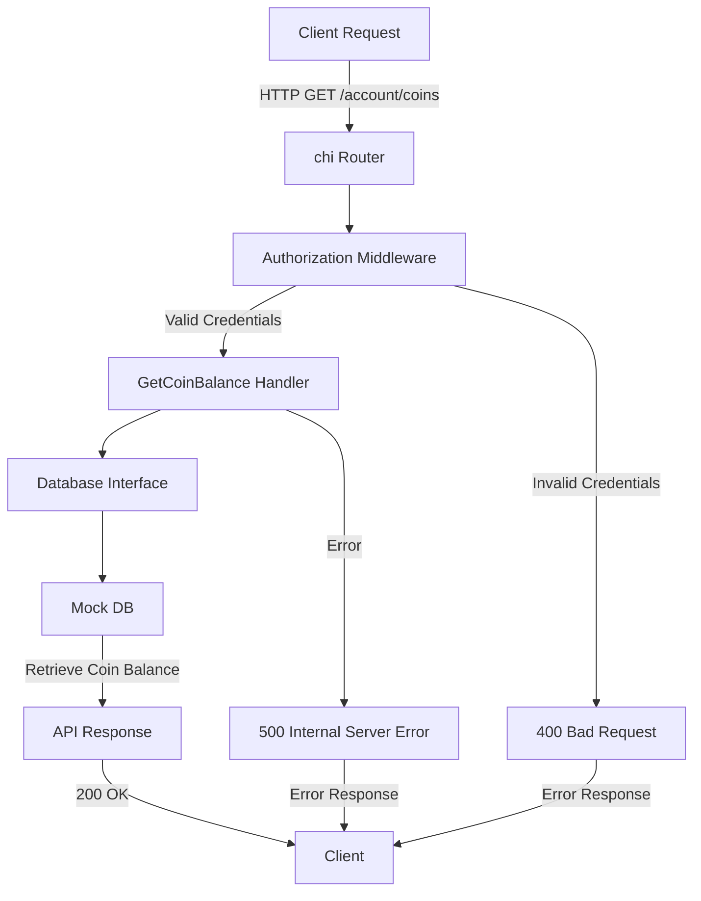

# Go API Service

This is a simple Go API service that provides endpoints to get coin balances for users. It uses the `chi` router for handling HTTP requests and `logrus` for logging.

## Project Structure

```markdown
📦 goapi
 ┣ 📂 api
 ┃ ┗ 📜 api.go                  # API configuration and setup
 ┣ 📂 cmd
 ┃ ┗ 📜 main.go                 # Application entry point
 ┣ 📂 internal
 ┃ ┣ 📂 handlers
 ┃ ┃ ┗ 📜 get_coin_balance.go   # Handler for coin balance endpoint
 ┃ ┣ 📂 middleware
 ┃ ┃ ┗ 📜 authorization.go      # Authorization middleware
 ┃ ┗ 📂 tools
 ┃   ┣ 📜 database.go           # Database interface
 ┃   ┗ 📜 mockdb.go            # Mock database implementation
 ┣ 📜 go.mod              # Go module definition
 ┣ 📜 go.sum              # Go module checksums
 ┗ 📜 README.md           # Project documentation
```

## Installation

1. Clone the repository:

    ```sh
    git clone https://github.com/louremipsum/goapi.git
    cd goapi
    ```

2. Install dependencies:

    ```sh
    go mod tidy
    ```

## Running the Service

To start the Go API service, run the following command:

```sh
go run cmd/main.go
```

The service will start and listen on `localhost:8080`.

## Endpoints

### Get Coin Balance

- **URL:** `/account/coins`
- **Method:** `GET`
- **Query Parameters:**
  - username (required): The username of the account.
- **Headers:**
  - Authorization (required): The authorization token.
- **Response:**
  - `200 OK`: Returns the coin balance for the user.
  - `400 Bad Request`: If the request is invalid.
  - `500 Internal Server Error`: If an unexpected error occurs.

Example request:

```sh
curl -H "Authorization: 1234ABC" "http://localhost:8080/account/coins?username=alex"
```

## Middleware

### Authorization

The Authorization middleware checks if the request contains a valid username and authorization token. If the credentials are invalid, it returns a `400 Bad Request` response.

## Tools

### Database

The `DatabaseInterface` defines methods for interacting with the database. The `mockDB` struct provides a mock implementation of the database for testing purposes.

## Logging

The service uses `logrus` for logging. Logs include the caller information to help with debugging.

## License

This project is licensed under the MIT License.

## Credits

Made using [Learn GO Fast: Full Tutorial](https://www.youtube.com/watch?v=8uiZC0l4Ajw) by Alex Mux which is an excellent tutorial for learning GO.

## Working

### 1. Project Overview

This is a basic GO API service that implements a coin balance checking system with authentication. The project follows a clean architecture pattern with separate packages for handlers, middleware, tools, and API definitions.

### 2. File-by-file Documentation

#### [main.go](cmd/main.go)

This is the entry point of the application.

- Initializes the chi router
- Sets up logging with logrus
- Starts the HTTP server on localhost:8080
- Displays an ASCII art banner on startup
- Connects to the handlers package to set up routes

#### [api.go](internal/handlers/api.go)

Defines the routing configuration using the chi router.

- Sets up global middleware (StripSlashes)
- Creates an `/account` route group
- Applies Authorization middleware to all `/account` routes
- Maps the `/coins` endpoint to GetCoinBalance handler
- Connects with: middleware.Authorization and handlers.GetCoinBalance

#### [get_coin_balance.go](internal/handlers/get_coin_balance.go)

Implements the coin balance checking endpoint.
Key functionality:

- Decodes URL query parameters
- Connects to the database
- Retrieves user coin balance
- Returns JSON response with balance
- Uses error handling from api package
Dependencies:
- tools.DatabaseInterface for data access
- api.CoinBalanceParams for request structure
- api.CoinBalanceResponse for response structure

#### [database.go](internal/tools/database.go)

Defines the database interface and structures.
Key components:

- LoginDetails structure (username + auth token)
- CoinDetails structure (username + coin balance)
- DatabaseInterface defining required methods
- Factory method NewDatabase() to create database instances
Connects with: mockDB implementation

#### [mockdb.go](internal/tools/mockdb.go)

Implements a mock database for testing/development.
Features:

- In-memory storage using maps
- Simulated 1-second delay for realistic behavior
- Mock data for users: alex, john, marie
- Implements DatabaseInterface methods:
  - GetUserLoginDetails
  - GetUserCoins
  - SetupDatabase

#### [authorization.go](internal/middleware/authorization.go)

Implements authentication middleware.
Key features:

- Validates username from URL query
- Validates Authorization header token
- Checks credentials against database
- Blocks unauthorized requests
Dependencies:
- tools.DatabaseInterface for user verification
- api package for error handling

#### [api.go](api/api.go)

Defines API structures and error handling.
Components:

- CoinBalanceParams: Request parameters
- CoinBalanceResponse: Response structure
- Error: Standard error response structure
- Helper functions for error responses
Used by: handlers and middleware

#### Flow Diagram



This flowchart shows the detailed working of the API:

1. **Client Request**: The client sends an HTTP GET request to `/account/coins`.
2. **chi Router**: The request is routed through the `chi` router.
3. **Authorization Middleware**: The middleware checks for valid credentials.
   - If credentials are valid, the request proceeds to the handler.
   - If credentials are invalid, a `400 Bad Request` response is returned.
4. **GetCoinBalance Handler**: The handler processes the request.
5. **Database Interface**: The handler interacts with the database interface.
6. **Mock DB**: The mock database retrieves the coin balance for the user.
7. **API Response**: The handler sends the coin balance in the response.
   - If successful, a `200 OK` response is returned to the client.
   - If an error occurs, a `500 Internal Server Error` response is returned.

#### Common Patterns

1. Error handling: All errors are logged and returned as structured responses
2. Database abstraction: Interface-based design allows easy switching of implementations
3. Middleware: Centralized authentication
4. Response formatting: Consistent JSON response structure

This API demonstrates good GO practices including:

- Interface-based design
- Separation of concerns
- Middleware pattern
- Clean error handling
- Structured logging
- Modular architecture
